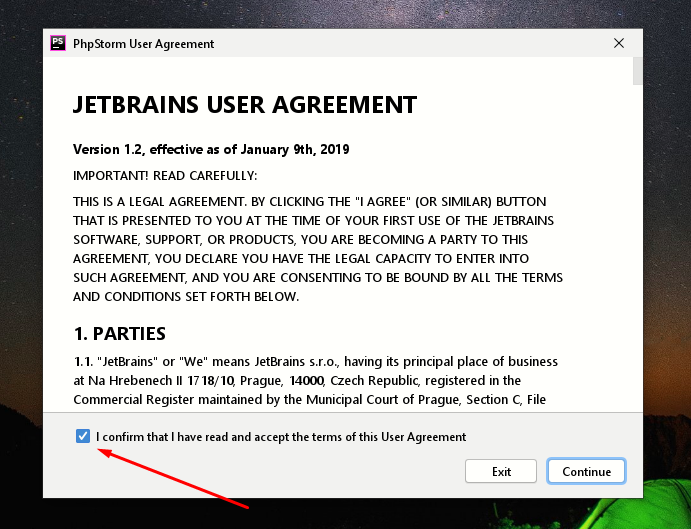
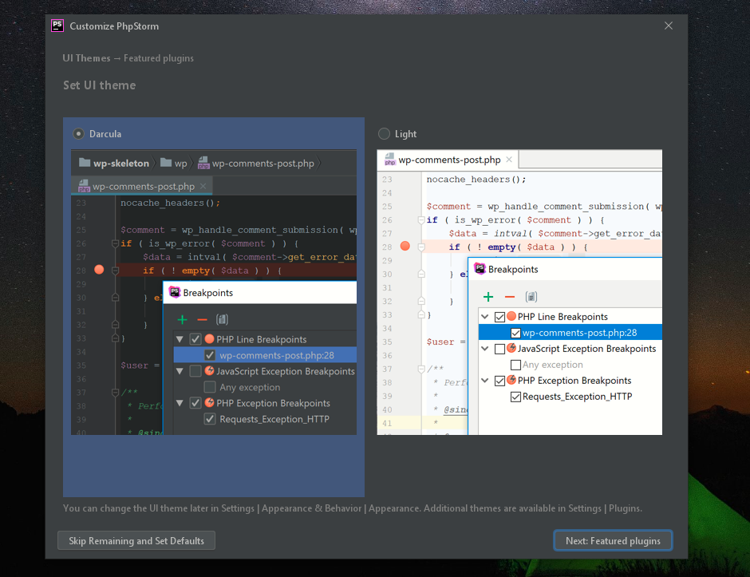
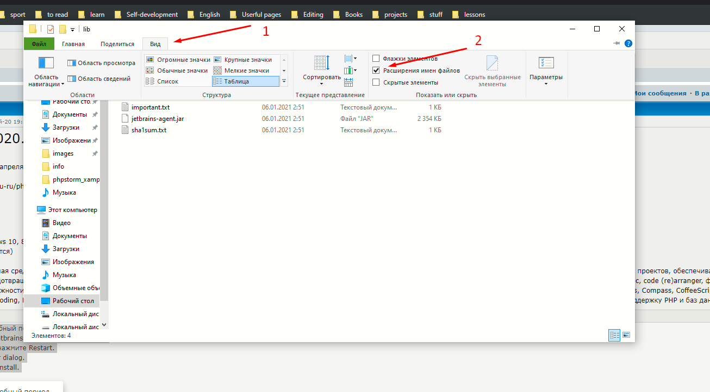
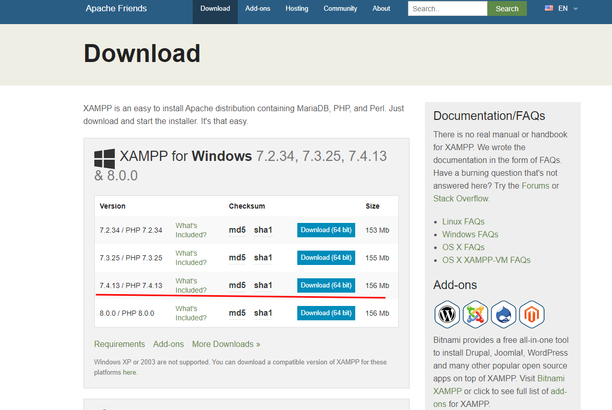

# Установка PhpStorm и XAMPP на  Windows

  <h1>
    🎯 Weekly Fuck The Code
<ul id="navbar">
  <li><a href="https://t.me/adm00103"> 🍏 About me 🍏 </a></li>
  <li><a href="https://t.me/id_adm00103"> 🧩 My Telegram 🧩 </a></li>
  <li><a href="https://t.me/NETSTALKER_RU"> 💻 Hacking Telegram 💻 </a></li>
  <li><a href="https://t.me/MAD101_bot"> 💌 Contact with me 💌 </a></li>
  <li><a href="https://vk.com/id_adm00103"> 🍏 My Vk 🍏 </a></li>
</ul>
  </h1>

 
## PhpStorm платный и по этому мы скачаем его с лечением

* [Google Drive](https://t.me/filecloudfile/324)
* [Telegram](https://t.me/filecloudfile/324)

### Есть версия PhpStorm-2020.3.3

* [Telegram](https://t.me/filecloudfile/320)

### При установке

* Соглашаемся

* Выбираем тему, я люблю черный

### Как воспользоватся лечением?

1. Запустите IDE и согласитесь на пробный период.
2. Перетащите из папки Лечение\lib\jetbrains-agent.jar на форму IDE (IDE - это редактор кода, в нашем случае PhpStorm).
   * Если не видно расширение .jar
   
3. Появится окно установки плагина, нажмите Restart.
4. Появится окно JetbrainsAgent Helper dialog.
5. Выберете тип лицензии и нажмите install.
6. Перезапустите IDE, все.

## XAMPP

* [Link to Download](https://www.apachefriends.org/download.html)
* [Link to Download](https://t.me/filecloudfile/324)

* Скачиваем версию 7.4 
  
  
* Скачиваем все по умолчанию

* НЕ ЗАБУДЬТЕ ПУТЬ, КУДА УСТАНОВИЛИ ЕГО

  <h1>
    🎯 Weekly Fuck The Code
<ul id="navbar">
  <li><a href="https://t.me/adm00103"> 🍏 About me 🍏 </a></li>
  <li><a href="https://t.me/id_adm00103"> 🧩 My Telegram 🧩 </a></li>
  <li><a href="https://t.me/NETSTALKER_RU"> 💻 Hacking Telegram 💻 </a></li>
  <li><a href="https://t.me/MAD101_bot"> 💌 Contact with me 💌 </a></li>
  <li><a href="https://vk.com/id_adm00103"> 🍏 My Vk 🍏 </a></li>
</ul>
  </h1>

